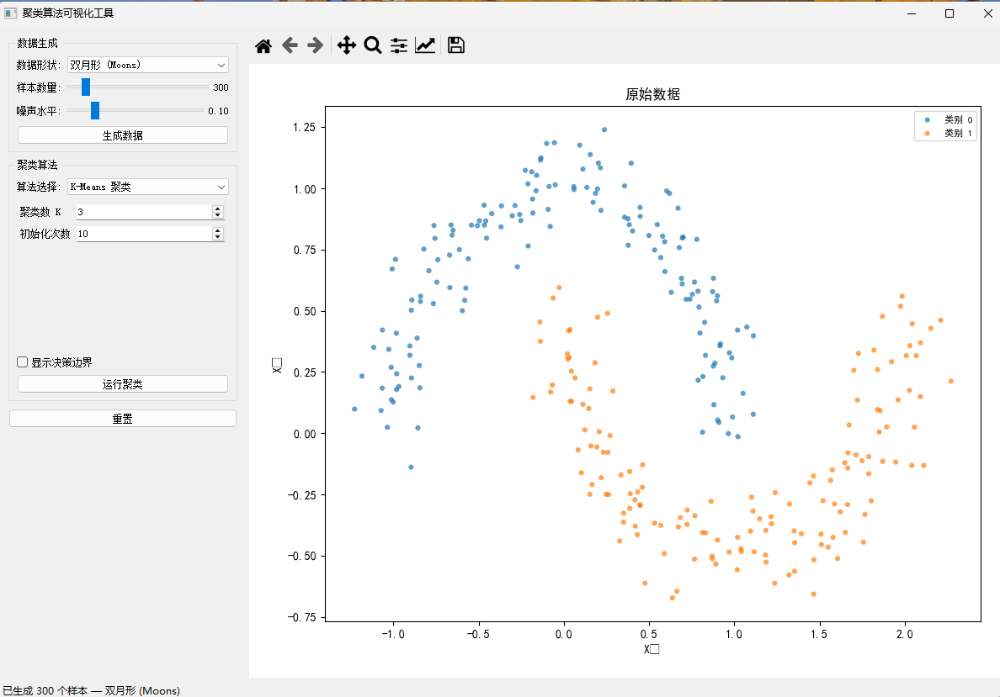
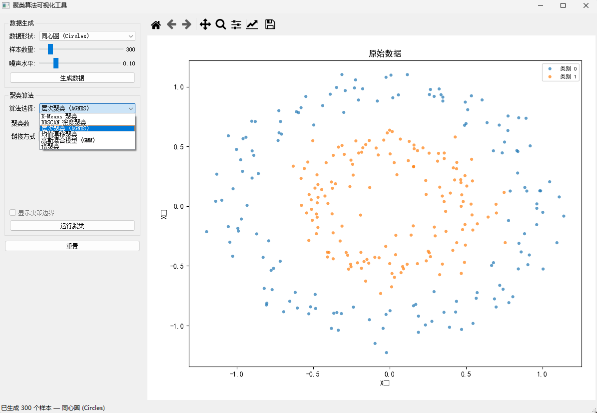
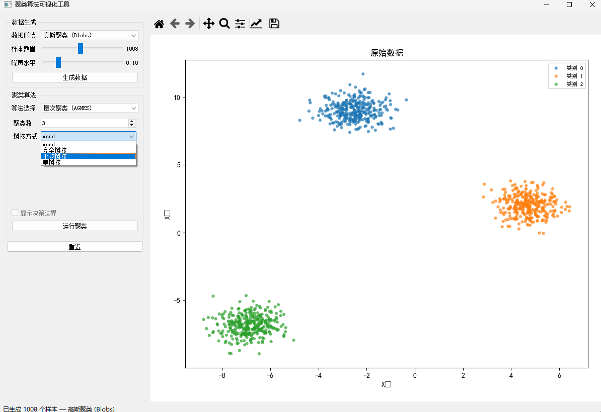

# 聚类算法可视化 (PyQt5)

一个用于探索经典聚类算法的桌面 GUI，支持在二维合成数据上交互式对比效果。

## 功能概览
- 算法：K-Means、DBSCAN、层次聚类 (AGNES)、MeanShift、GMM、谱聚类
- 数据形状：高斯团簇、双月、同心圆、各向异性、不同密度
- 指标：轮廓系数、聚类数、噪声点数、运行耗时
- 可选决策边界（支持预测的算法：K-Means、GMM、MeanShift）

## 界面截图





## 环境要求
- 推荐 Python 3.9+
- Windows/macOS/Linux 均可运行（已在 Windows 测试）

## 快速开始

1) 创建虚拟环境（可选，但推荐）

```bash
python -m venv .venv
```

2) 安装依赖

```bash
pip install -r requirements.txt
```

3) 运行应用

```bash
python main.py
```

## 使用流程
1) 在“数据生成”中选择数据形状、样本数量、噪声水平，点击“生成数据”。
2) 在“聚类算法”中选择算法，并调整对应参数。
3) 若算法支持预测，可勾选“显示决策边界”。
4) 点击“运行聚类”，右侧图像将显示聚类结果与指标。
5) 点击“重置”可回到初始状态。

## 数据形状说明
- 高斯团簇 (Blobs)：多个高斯分布团簇。
- 双月 (Moons)：非线性弯月形结构。
- 同心圆 (Circles)：两个同心圆环。
- 各向异性 (Anisotropic)：经过线性变换拉伸的团簇。
- 不同密度 (Varied)：各簇方差不同，密度差异明显。

## 算法与主要参数
- K-Means：`n_clusters` 聚类数，`n_init` 初始化次数。
- DBSCAN：`eps` 邻域半径，`min_samples` 最小样本数。
- 层次聚类 (AGNES)：`n_clusters` 聚类数，`linkage` 链接方式。
- MeanShift：`bandwidth` 带宽（可自动估计）。
- GMM：`n_components` 成分数，`covariance_type` 协方差类型。
- 谱聚类：`n_clusters` 聚类数，`affinity` 亲和度类型。

## 指标说明
- 轮廓系数：衡量聚类紧密度与分离度，越高越好；不足 2 类时显示为 -1。
- 聚类数：忽略噪声点后的簇数量。
- 噪声点数：仅 DBSCAN 可能出现。
- 运行耗时：算法拟合的时间（毫秒）。

## 项目结构
- main.py：程序入口
- core/：聚类逻辑与数据生成
- gui/：PyQt5 界面与 Matplotlib 画布
- utils/：聚类指标计算
- picture/：README 截图

## 备注
- 如果中文显示为方块，请安装 SimHei 或 Microsoft YaHei 字体。
- “显示决策边界”仅对支持 `predict` 的算法生效。

